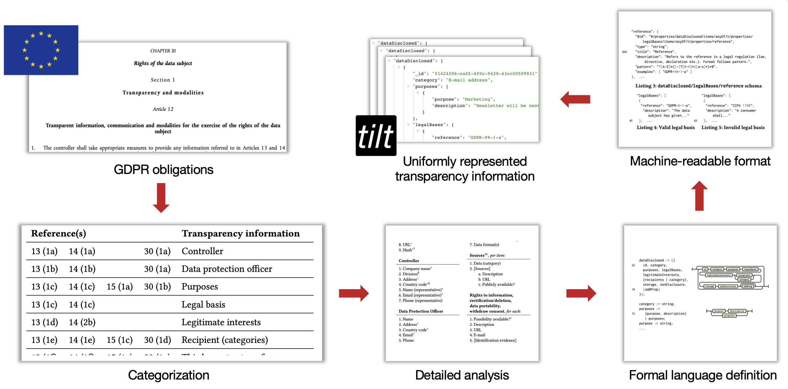

# TILT: A GDPR-Aligned Transparency Information Language and Toolkit for Practical Privacy Engineering



We present TILT, a transparency information language and toolkit explicitly designed to represent and process transparency information in line with the requirements of the **GDPR** and allowing for a more automated and adaptive use of such information than established, legalese data protection policies do.

We provide a detailed analysis of transparency obligations from the GDPR to identify the expressiveness required for a **formal transparency language** intended to meet respective legal requirements. In addition, we identify a set of further, non-functional requirements that need to be met to foster practical adoption in real-world (web) information systems engineering. On this basis, we specify our formal language and present a respective, **fully implemented toolkit** around it. We then evaluate the practical applicability of our language and toolkit and demonstrate the additional prospects it unlocks through two different use cases: a) the **inter-organizational analysis of personal data-related practices** allowing, for instance, to uncover data sharing networks based on explicitly announced transparency information and b) the **presentation of formally represented transparency information to users through novel, more comprehensible, and potentially adaptive user interfaces**, heightening data subjects’ actual informedness about data-related practices and, thus, their sovereignty.

Altogether, our transparency information language and toolkit allow – differently from previous work – to express transparency information **in line with actual legal requirements and practices of modern (web) information systems engineering** and thereby pave the way for a multitude of novel possibilities to heighten transparency and user sovereignty in practice.

## Citation

Elias Grünewald and Frank Pallas. 2021. TILT: A GDPR-Aligned Transparency Information Language and Toolkit for Practical Privacy Engineering. In _Conference on Fairness, Accountability, and Transparency (FAccT ’21)_, _March 3–10, 2021_, _Virtual Event, Canada_. ACM, New York, NY, USA, 12 pages. https://doi.org/10.1145/3442188.3445925

```
@inproceedings{gruenewald2021,
    title = {TILT: A GDPR-Aligned Transparency Information Language and Toolkit for Practical Privacy Engineering},
    booktitle = {Proceedings of the 2021 Conference on Fairness, Accountability, and Transparency},
    publisher = {Association for Computing Machinery},
    address = {New York, NY, USA},
    author = {Elias Grünewald and Frank Pallas},
    year = {2021},
    series = {FAccT '21},
    doi = {10.1145/3442188.3445925},
    isbn = {978-1-4503-8309-7/21/03},
    url = {https://dl.acm.org/doi/10.1145/3442188.3445925}
}
```

## Source Code

Related to the publication are the following repositories:
- https://github.com/Transparency-Information-Language/schema
- https://github.com/Transparency-Information-Language/vocabularies
- https://github.com/Transparency-Information-Language/tilt-hub
- https://github.com/Transparency-Information-Language/java-tilt
- https://github.com/Transparency-Information-Language/python-tilt
- https://github.com/Transparency-Information-Language/chrome-tilt
- https://github.com/Transparency-Information-Language/transparency-analysis-platform

## Contact
If you have questions, open an issue here on Github or contact Elias Grünewald via his [institutional website](https://www.ise.tu-berlin.de/menue/team/elias_gruenewald/parameter/en/).
